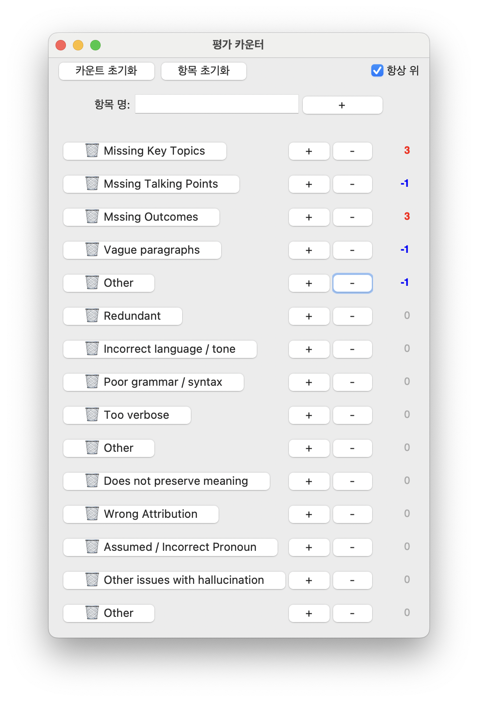

# 카운터 프로그램 (Counter Program)

간단한 항목별 카운터 프로그램입니다. (A simple counter program for each item.)



## 기능 (Features)

- 항목 추가 및 이름 설정 (Add items and set their names)
- 각 항목별 + 및 - 버튼을 통한 카운트 증감 (Increment/decrement count for each item using + and - buttons)
- 휴지통 아이콘 버튼으로 항목 삭제 (Delete an item using the trash icon button)
- 항상 위 옵션 (Always on top option)
- 카운트 초기화 버튼 (Reset all counts button)
- 항목 초기화 버튼 (Reset all items button)
- Enter 키로 항목 추가 (Add items using the Enter key)

## 설치 및 실행(Installation and Use)

1.  [프로그램 다운로드](https://github.com/saramjh/pycounter/archive/refs/heads/main.zip)에서 최신 릴리즈를 다운로드합니다. (Download the latest release from the [Program download](https://github.com/saramjh/pycounter/archive/refs/heads/main.zip).)
2.  압축 파일(.zip 등)을 해제합니다. (Unzip the downloaded file (.zip, etc.).)
3.  dist 디렉토리 내의 실행 파일(윈도우용 `pycounter` 또는 맥용 `pycounter.app`)을 실행합니다. (Run the executable file (`pycounter` for Windows or `pycounter.app` for Mac).)

또는, 파이썬이 설치되어 있는 경우 소스 코드를 직접 실행할 수 있습니다. (Alternatively, if Python is installed, you can run the source code directly.)

1.  저장소를 클론합니다. (Clone the repository.)
    ```bash
    git clone https://github.com/saramjh/pycounter.git
    ```
2.  필요한 라이브러리를 설치합니다. (Install required libraries.) (이 예제에서는 필요 없음)
    ```bash
    # pip install -r requirements.txt (필요한 경우)
    ```
3.  프로그램을 실행합니다. (Run the program.)
    ```bash
    python pycounter.py
    ```

## 사용 방법 (How to Use)

1.  "항목 명:" 입력 창에 추가할 항목의 이름을 입력합니다. (Enter the name of the item you want to add in the "항목 명:" input field.)
2.  "+" 버튼을 클릭하거나 Enter 키를 눌러 항목을 추가합니다. (Click the "+" button or press the Enter key to add the item.)
3.  각 항목 옆의 "+" 및 "-" 버튼을 사용하여 카운트 값을 조절합니다. (Use the "+" and "-" buttons next to each item to adjust the count.)
4.  카운트 숫자는 0일 때는 회색, 양수일 때는 빨간색, 음수일 때는 파란색으로 표시됩니다. (The count number is displayed in gray when zero, red when positive, and blue when negative.)
5.  "항상 위" 체크박스를 선택하여 창을 항상 최상위에 표시할 수 있습니다. (Check the "항상 위" checkbox to keep the window always on top.)
6.  "카운트 초기화" 버튼을 클릭하여 모든 항목의 카운트를 0으로 초기화합니다. (Click the "카운트 초기화" button to reset all counts to 0.)
7.  "항목 초기화" 버튼을 클릭하여 모든 항목을 삭제합니다. (Click the "항목 초기화" button to delete all items.)

## 빌드 방법 (How to Build) (개발자를 위한 설명)

이 프로젝트는 `pyinstaller`를 사용하여 빌드되었습니다. (This project is built using `pyinstaller`.)

```bash
pip install pyinstaller
pyinstaller --onefile --windowed --icon=icon.icns pycounter.py # 아이콘이 있는 경우
pyinstaller --onefile --windowed pycounter.py # 아이콘이 없는 경우
```

## macOS에서 실행 문제 해결 (Resolving macOS Execution Issues)

macOS에서 "Apple이 앱에 악성 소프트웨어가 있는지 확인할 수 없음" 경고가 나타날 경우, [이 블로그 글](https://blog.naver.com/sinnam88/223348280982)을 참고하여 문제를 해결할 수 있습니다. (If you encounter the "Apple cannot check app for malicious software" warning on macOS, you can refer to [this blog post](https://blog.naver.com/sinnam88/223348280982) for a solution.)
